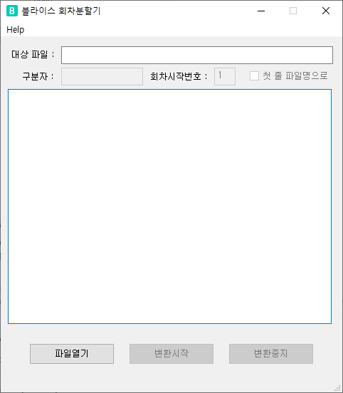

# BliceTextSplitter

## 사용방법

1. 파일열기   
분할하려는 원본 파일을 열면, 첫 100라인을 분석해서 텍스트내 문자열 인코딩 상태를 체크해서 표시함
2. 구분자   
분할을 하기 위한 구분자를 입력
3. 회차시작번호   
출력파일명은 ' 원본파일명_(회차시작번호)화.txt ' 형태이다.(ex. test_1화.txt)   
기본 1로 설정되고, 필요시 숫자를 변경하면 해당 숫자부터 파일명 뒷부분이 결정   
4. 첫 줄 파일명으로   
출력파일명을 ' 원본파일명_(회차시작번호)화.txt ' 형태 대신 구분자 다음에 오는 문자열을 파일명으로 하고 싶을 때 체크   
ex) 체크시 test_1화.txt 대신 테스트 1회.txt 파일로 생성됨.
5. 변환중지   
중간에 이상하다 싶으면 중단할 수 있다.   
하지만, 텍스트만 다루는 어플이다보니 중단하기전에 대부분 분할이 끝나버린다.

## Release
+ Release v1.0.0 (2021.02.15)
